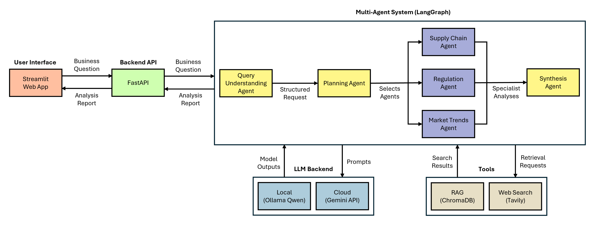

# Didymaion - A Multi-Agent System for Market Prediction & Analysis

Didymaion is a multi-agent system that assists with the prediction and analysis of current market trends. It is designed around specialized agents that collaborate to solve complex business questions whether related to crude oil, cocoa, real estate, pharmaceuticals or other rapidly evolving global commodities. 

This concept originates from the course "Applied Artificial Intelligence Project" at TU Berlin.

## Key Features
- **Multi-Agent Architecture**:
    - Query Understanding Agent for processing natural language business questions.
    - Planning Agent that dynamically selects specialist agents.
    - Specialist Agents:
        - Supply Chain Agent investigating the availability and movement of the resource.
        - Regulation Agent conducting research on legal and political aspects.
        - Market Trends Agent focusing on market dynamics and future outlook.
    - Synthesis Agent that combines all specialist analyses into one business report.
    - Implemented using LangChain and LangGraph.
- **Prompt Templates**: Definition of each agent's task ensuring consistent and specialized behavior.
- **Real-Time Web Search**: Integration of the latest economic data and industry reports using the Tavily API.
- **Retrieval-Augmented Generation (RAG)**: Integration of internal documents embedded with Ollama's `nomic-embed-text` model and managed by a ChromaDB vector database.
- **Configurable LLM Backend**: Use of either a local Ollama model or a cloud LLM. For this project, we use Ollama's `qwen2.5:3b` and `gemini-2.5-flash` provided by the Google Gemini API.
- **User Interface & API Layer**: REST-API built with FastAPI and interactive frontend using Streamlit.
- **Example Interaction**: [Example](assets/example.pdf) of a business question and the generated report are provided in this project.

## System Architecture

<p float="left">
  
</p>

# Project Structure

```
didymaion/

├── src/
│
├── agents/
│   ├── query_understanding.py
│   ├── planner.py
│   ├── supply_chain.py
│   ├── regulation.py
│   ├── market_trends.py
│   └── synthesizer.py
│
├── prompts/                                # Prompt templates for all agents
│
├── tools/
│   ├── web_search.py                       # Tavily web search
│   └── rag.py                              # Retrieval-Augmented Generation (RAG)
│
├── data/
│   ├── documents/                          # Internal documents
│   └── chroma_db/                          # ChromaDB vector database
│
├── scripts/
│   └── build_rag_index.py                  # Builds ChromaDB vector database
│
├── frontend.py                             # Streamlit user interface
├── main.py                                 # FastAPI backend
├── llm.py                                  # LLM backend configuration
├── orchestrator.py                         # Workflow of multi-agent system
├── schemas.py                              # Defines API requests/responses and LLM outputs
├── config.py                               # Loads environment variables
```

# Setup & Installation

## Install dependencies

```bash
pip install -r requirements.txt
```

## Embedding model

For Retrieval-Augmented Generation (RAG), install [Ollama](https://ollama.com/) and run:

```bash
ollama pull nomic-embed-text
```

Alternatively, the embedding backend can easily be replaced with other embedding providers (e.g., Google, OpenAI, or Voyage AI) with minor code changes.

## Configure environment

For real-time web search and LLM inference, create a `.env` file and specify:

```
LLM_PROVIDER=ollama

TAVILY_API_KEY=YOUR_KEY

GOOGLE_API_KEY=YOUR_KEY
```

For using an external LLM, use `LLM_PROVIDER=google`. Alternatively, instead of Google, one can use other cloud model providers, such as OpenAI or Anthropic. Corresponding code changes and installations must then be carried out.

In case of utilizing a local model, download a model:

```
ollama pull qwen2.5:3b
```

Other models can also be used, e.g., `qwen2.5:7b`, `gemma3:4b`, `llama3.2:3b`.

## Build the RAG index

```
python scripts/build_rag_index.py
```

## Start the multi-agent system

To run the web server:

```
uvicorn main:app --reload
```

In another terminal, run frontend:

```
streamlit run frontend.py
```

## Docker

Alternatively, one can run this project inside a Docker container.

First, create a .env.docker file:
```
LLM_PROVIDER=ollama

# Alternatively:
# LLM_PROVIDER=google

TAVILY_API_KEY=YOUR_KEY

GOOGLE_API_KEY=YOUR_KEY

API_URL=http://backend:8000/analyze-query

OLLAMA_BASE_URL=http://host.docker.internal:11434
```

Before starting the containers, build the ChromaDB vector database:

```
python scripts/build_rag_index.py
```

Build and start the frontend and backend:

```
docker compose up --build
```

After startup, open the web interface:

```
http://localhost:8501
```

# Future Improvements

- Additional specialist agents (Competitor Intelligence, Technology/Innovation, ESG etc.)
- Parallel execution of independent agents
- Integration of domain-specific APIs, such as financial market, economics, or logistics.
- Interactive chat interface
- Long-term memory
